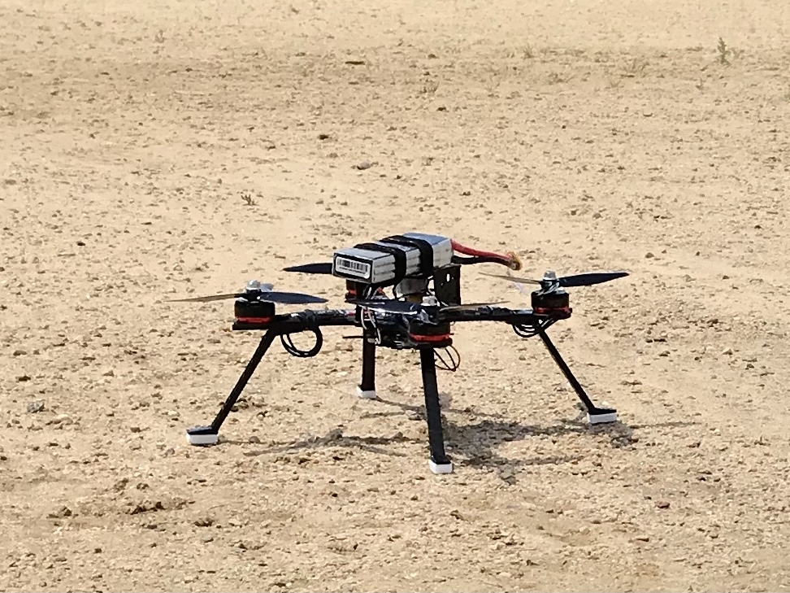
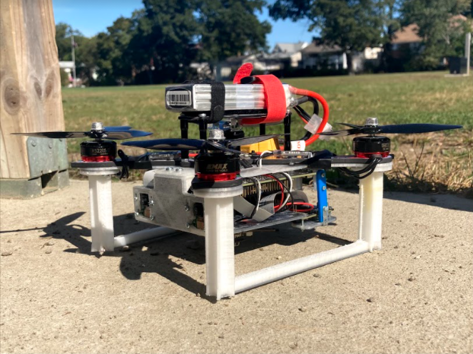
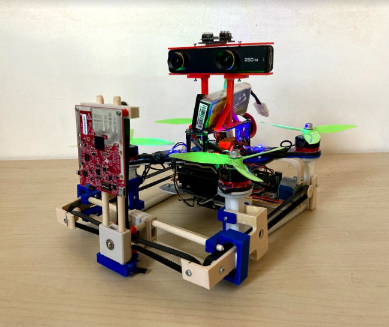

# Drone Frame Design

(drone_frame_part1-7.stl files are printable design for Mark-III)

## Mark I:

## Mark II:               
-	https://a360.co/3cW5fhv
-	Dimension: 285 x 285 x 140 mm
-	Weight: 753 g (including new base, battery, Jetson Nano, Crazyflie, Stereo Pi (83g))

## Mark III (latest):                    
-	https://a360.co/2MDfe0j
-	Dimension: 285 x 300 x 160 mm
-	Weight: ~930 g (including new base, battery, Jetson Nano, Crazyflie, ZED mini (60g), IWR6483ISK (8g), slider (~120g), stepper motors (70g))

